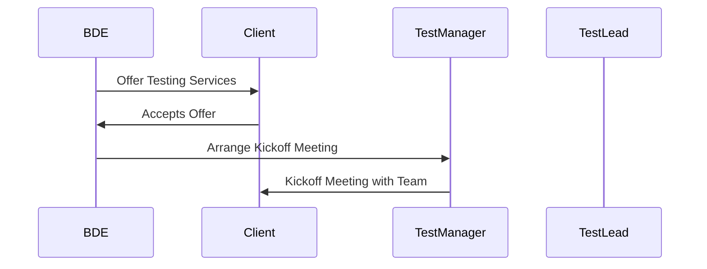

# 🧪 [Session 7: Independent Software Testing Live Project (Part 1) - How a Project Begins](https://www.youtube.com/watch?v=IvXvrMbkKes&list=PLsjUcU8CQXGGguAbeip-Q_ZckElVGUwxQ&index=7)

## Topic: How a Project Begins in an Independent Software Testing Company 

### 📌 1. Introduction
This session explains how an Independent Software Testing (IST) project starts in a real-time company setup.

---

### 🏢 2. What is an Independent Software Testing Company?
- An Independent Software Testing Company only offers testing services, not development.
- Example: A private company like “Xyz Testing Services” works only as a third-party testing provider.
- These companies do not build applications — they only test applications built by their client companies.

--- 

### 👥 3. Understanding the Two Companies
| Role                     | Description                                                                                    |
| ------------------------ | ---------------------------------------------------------------------------------------------- |
| 🧑‍💼 **Client Company** | The company that owns the application to be tested. Example: `http://tutorialsninja.com/demo/` |
| 🧪 **Testing Company**   | The independent testing service provider. They do not develop apps, just test them.            |

--- 

### 🧩 How Projects Begin – Real-Time Example Flow
#### 1. 🧑‍💼 Role of BDE (Business Development Executive)
- Searches for potential **clients**.
- Sends **cold emails** about the testing services offered.
- Once the client shows interest (lead), a **Kick-off Meeting** is scheduled.

---

#### 2. 🤝 Kick-off Meeting
1. BDE (Business Development Executive) from the testing company contacts multiple companies offering their testing services.
2. Once a client company responds with interest, a kickoff meeting is arranged.
3. Participants in the kickoff meeting:
**Attendees:**
- Client
- Test Manager
- Test Lead
- BDE

**Purpose:**
- Client shares project details.
- Specifies the application URL, requirements, and expectations.

---

#### 📋 5. What Happens in Kickoff Meeting?
- Client shares:
  - Application URL (e.g., http://tutorialsninja.com/demo/)
  - High-level requirements
  - Expectations from the testing team
- Testing team is asked to explore the application for a week.
- A follow-up meeting is scheduled after the exploration phase.

--- 

#### 🔍 6. Role of the Testing Team
Week-long exploration of the application to:

- Understand functionality
- Identify initial test scenarios
- Detect basic issues
- This is also referred to as a Requirement Understanding Phase.

--- 

#### 🧑‍💼 7. Roles in Business Team
| Role                                           | Responsibility                                                 |
| ---------------------------------------------- | -------------------------------------------------------------- |
| 🧑‍💼 **BDE** (Business Development Executive) | Finds leads and initiates communication with potential clients |
| 🧑‍💼 **Senior BDE**                           | Manages BDEs and handles key accounts                          |
| 👨‍💼 **Business Development Manager**         | Oversees entire business development strategy                  |
| 📈 **Chief Business Manager**                  | Final authority for business decisions and project acquisition |

--- 

#### 🧾 8. Summary Points

1. BDE (Business Development Engineer) at the company will search for the Clients and emails them regarding the different Independent Testing Services provided by the company
2. Once he gets a reply/lead, he will arrange a kickoff meeting with the Client, Test Manager, Test Lead and himself
3. In Kickoff meeting, client gives the details about the Project and clearly mentions his requirements
4. Let's say the Client has given the http://tutorialsninja.com/demo/ application and asked us to start exploring the application till we decided to meet again in a week
5. Testing team explores the application for a week
